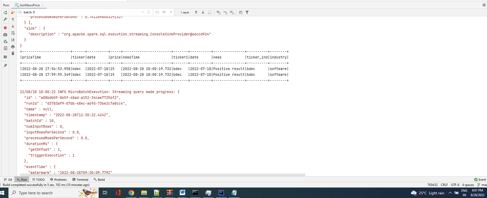
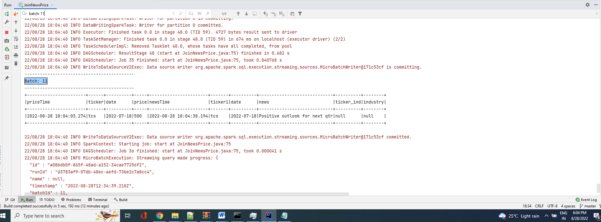

# Procedure:

**First create two topics:**

kafka-topics.bat --create --topic newstopic --bootstrap-server localhost:9092
kafka-topics.bat --create --topic stocktopic --bootstrap-server localhost:9092

**Produce message**

kafka-console-producer -broker-list localhost:9092 -topic stocktopic
kafka-console-producer -broker-list localhost:9092 -topic newstopic

**Msg example:**

#news
{"ticker1": "dono", "date": "2022-07-18", "news": "qtr loss"}
{"ticker1": "bdec", "date": "2022-07-18", "news": "Positive result"}
{"ticker1": "tcs", "date": "2022-07-18", "news": "Positive outlook for next qtr"}

#price
{"ticker": "dono", "date": "2022-07-18", "price": 10.08}
{"ticker": "bdec", "date": "2022-07-18", "price": 15}
{"ticker": "tcs", "date": "2022-07-18", "price": 500}

**With company:bdec**

**with company: dono**

**Company with no Industry category:**

